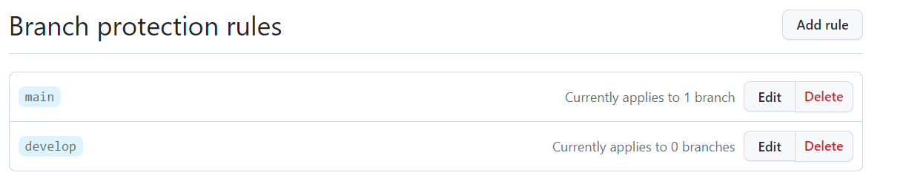
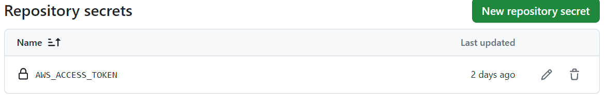
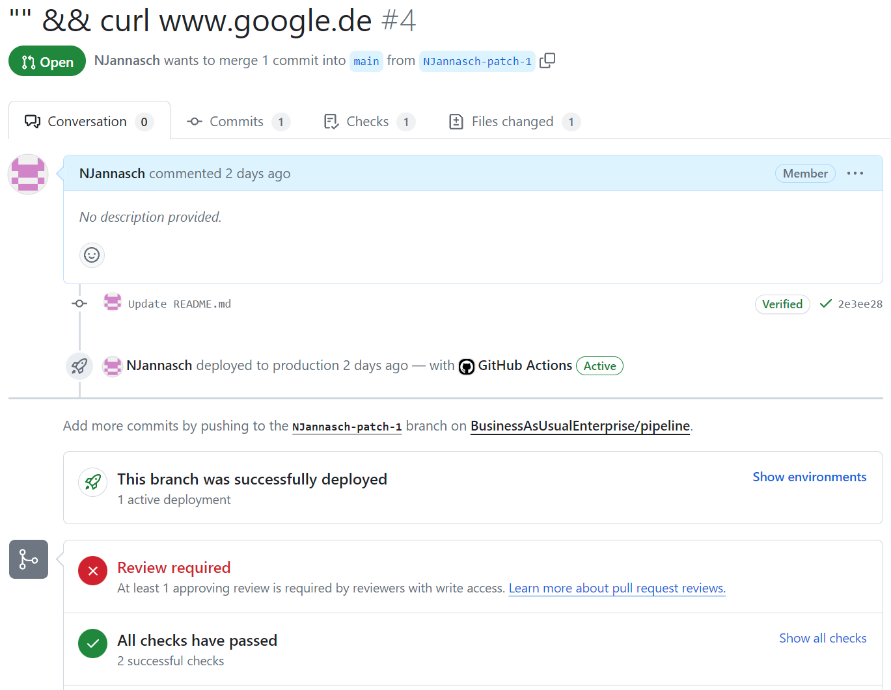
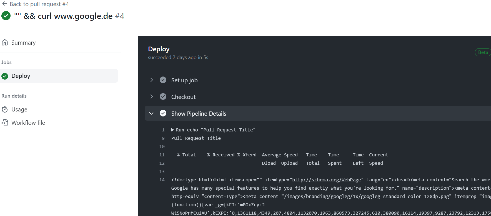

# CI/CD Security Example
This is a minimal example to highlight Direct Poisioned Pipeline Execution  
[https://owasp.org/www-project-top-10-ci-cd-security-risks/CICD-SEC-04-Poisoned-Pipeline-Execution](https://owasp.org/www-project-top-10-ci-cd-security-risks/CICD-SEC-04-Poisoned-Pipeline-Execution).

## Branch Protections

## Secrets

## Howto
Create a new branch and open a pull request. The pull request title can be used for command injection into the pipeline to e.g. access the secrets.  

This results into a call to google  

# Other
Made with ❤ in Dortmund